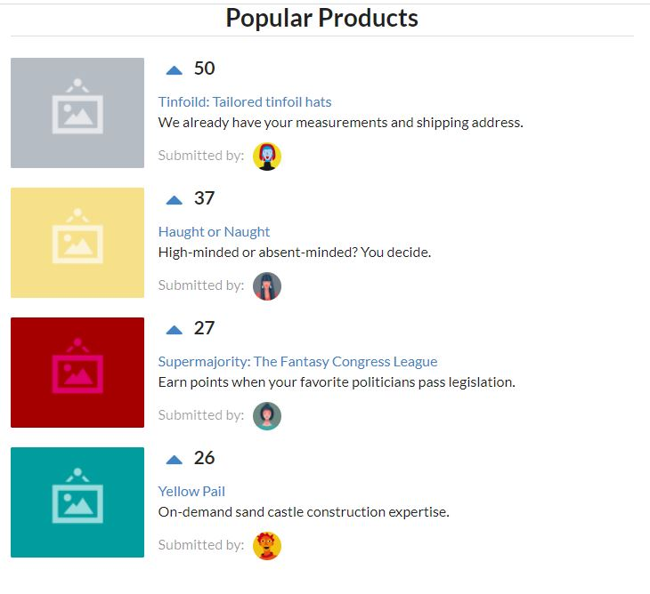
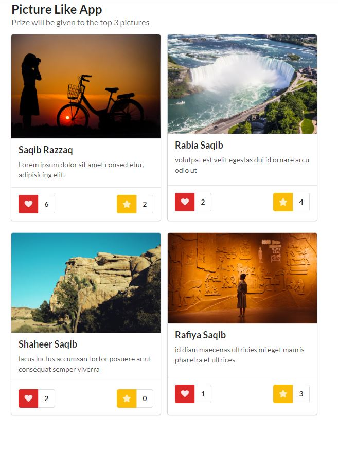
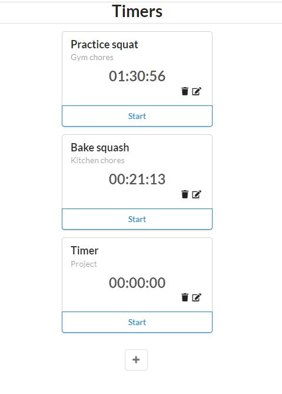
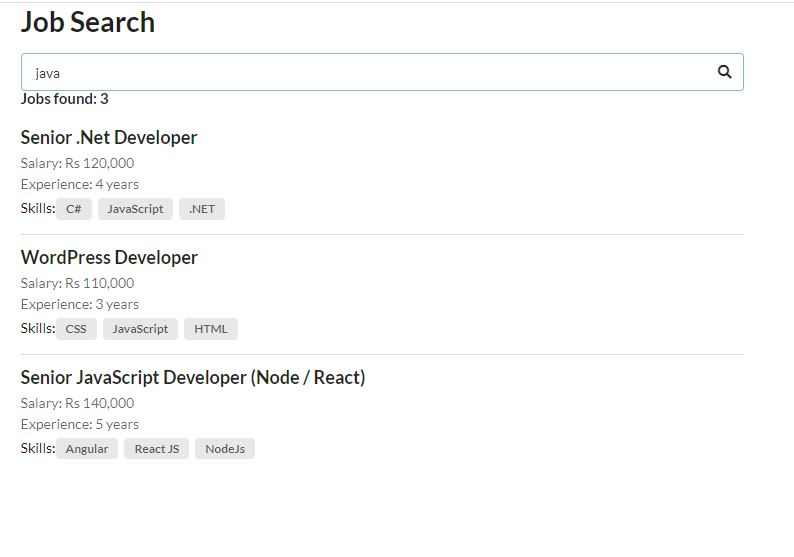

# React apps for learning and practice

## Voting

- Upvote your favorite product so that it reaches on top.
- Learn about state, reac class, componentDidMount, props
- parent to child communication - pass props
- child to parent communication - pass function in props, call from child

## Picture Like

- Like and add to favorite a picture
- The list will be sorted by max likes

## Time Tracking

- Add multiple timers
- CRUD operation for each timer
- Timers maintained in array

## Job Search

- Search keywords in job title and skills
- Data kept in array

Components heirarchy

- Search
  - Search Bar
  - Search Results
    - Search Results Summary
    - Filtered Job List
      - Job